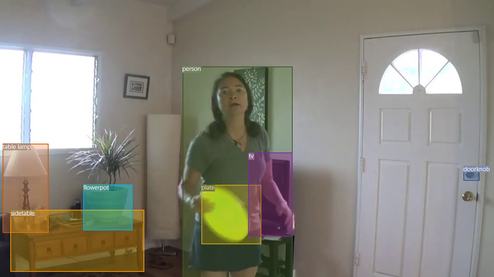
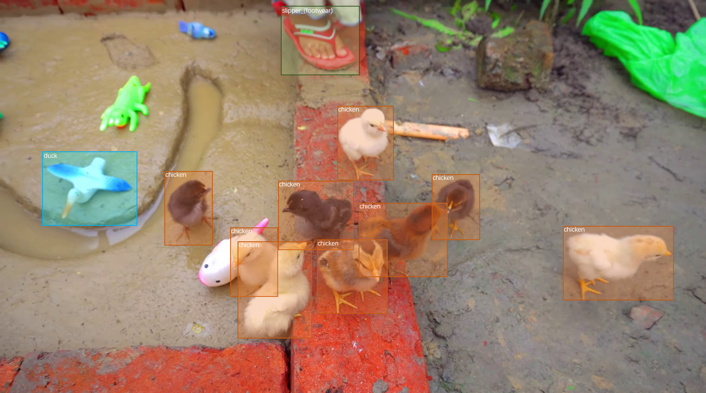
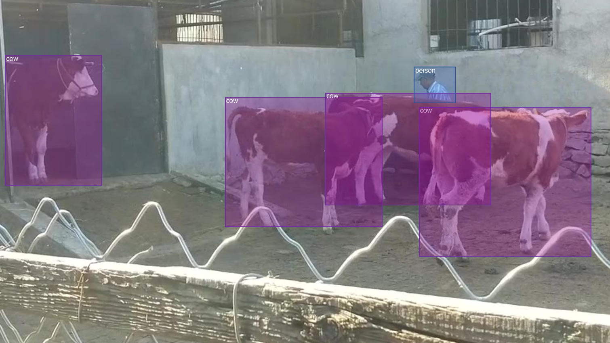

# OVT-B-Dataset
This repository contains the download link and usage instructions for the new dataset.


## News
🔥 [26/09/24] We are pleased to announce that our paper has been accepted to NeurIPS 2024 Datasets and Benchmarks Track.  

🔥 [02/09/24] We have uploaded the source code of several trackers implemented on our benchmark.


## Download

You can download the dataset from the following link:
[BaiDuYun](https://pan.baidu.com/s/1hy44z_om609jIhXjRxXCug?pwd=8yy3) (8yy3) and 
[GoogleDrive](https://drive.google.com/drive/folders/1Qfmb6tEF92I2k84NgrkjEbOKnFlsrTVZ?usp=drive_link).


## Description

This dataset OVT-B can be used as a new benchmark to the research of OVMOT.

## Usage

Instructions on how to use the dataset:

1. Download the dataset and annotation.
2. Extract the files.
3. Copy the ```CLASS```, ```base_id```, and ```novel_id``` from ovtb_classname.py and add them to the classname.py file under the roi_head folder of the ov detector.
4. Modify the ```data_root``` in the configs to the path where the OVT-B folder is located. Change ```ann_file``` to the path of ovtb_ann.json, ```img_prefix``` to data_root+'OVT-B', and ```prompt_path``` to the path of ovtb_class.pth.
5. Then test/evaluate by TAO-type/COCO-type dataset eval tools/codes.

## Organization

```
├── OVT-B
│   ├── AnimalTrack
│   │   ├── subdir
│   │   │   ├── img.jpg
│   │   │   └── ...
│   ├── GMOT-40
│   ├── ImageNet-VID
│   ├── LVVIS
│   ├── OVIS
│   ├── UVO
│   ├── YouTube-VIS-2021
├── ovtb_ann.json
├── ovtb_class.pth
├── ovtb_classname.py
├── ovtb_prompt.pth
└── OVTB-format.txt
```

## Data sample illustration

<div style="display: flex; justify-content: space-between;">
    
    
     
    
</div>

## Baseline Method

For detailed information on the baseline method, please refer to the [OVTrack](https://github.com/SysCV/OVTrack).

## Citation

If you use this dataset in your research, please cite it as follows:
```
@article{haiji2024ovtb,
  title={OVT-B: A New Large-Scale Benchmark for Open-Vocabulary Multi-Object Tracking},
  author={Liang, haiji and Han, Ruize},
  journal={arXiv preprint arXiv:2410.17534},
  year={2024}
}
```

## Acknowledgement
- Thanks [TETA](https://github.com/SysCV/tet) for providing the evaluation code.
- Thanks [DetPro](https://github.com/dyabel/detpro) for providing the pytorch reimplementation of VilD.
- Thanks [OVTrack](https://github.com/SysCV/OVTrack) for providing the baseline of OVMOT.
- Thanks [MMTracking](https://github.com/open-mmlab/mmtracking) for providing the code of OC-SORT, ByteTrack and StrongSORT.
